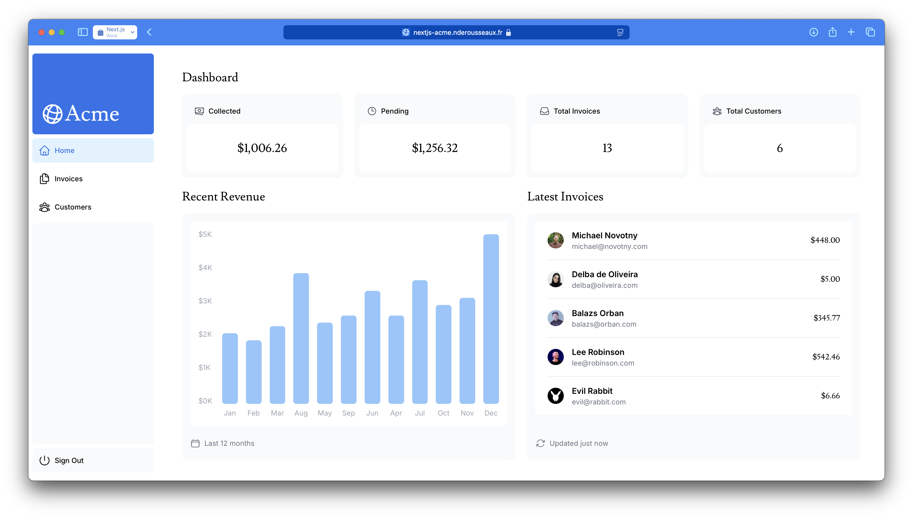
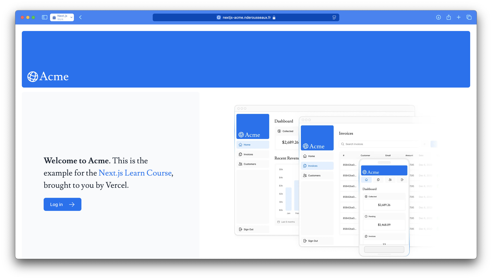
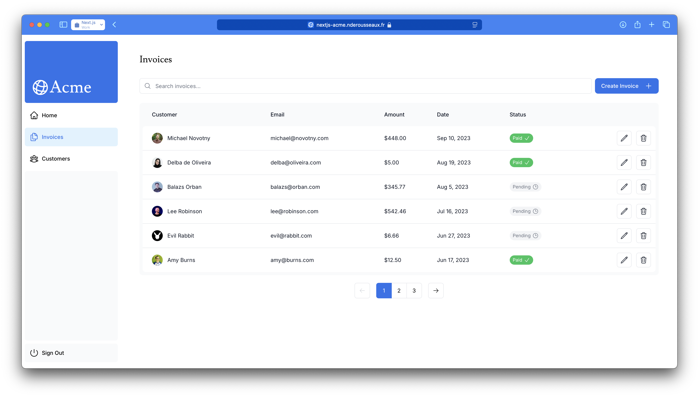
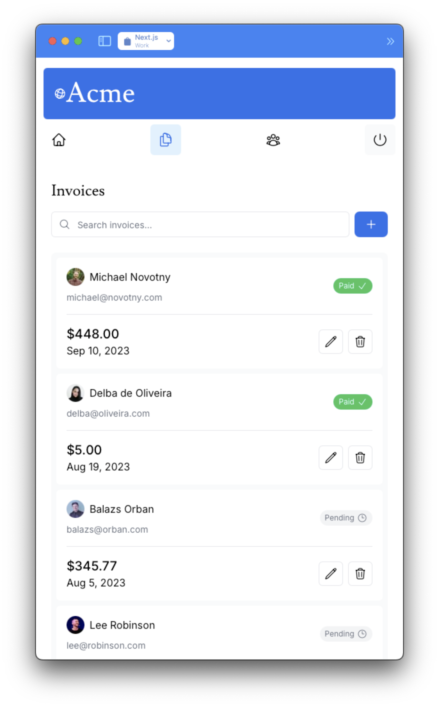
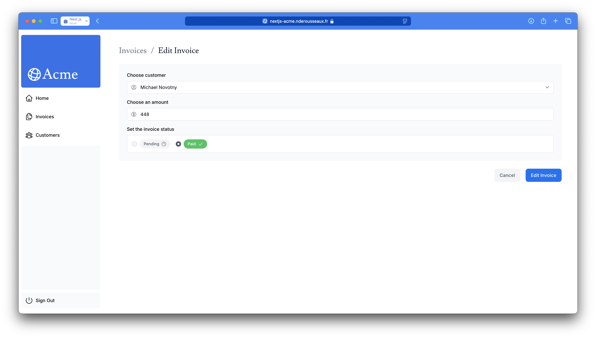
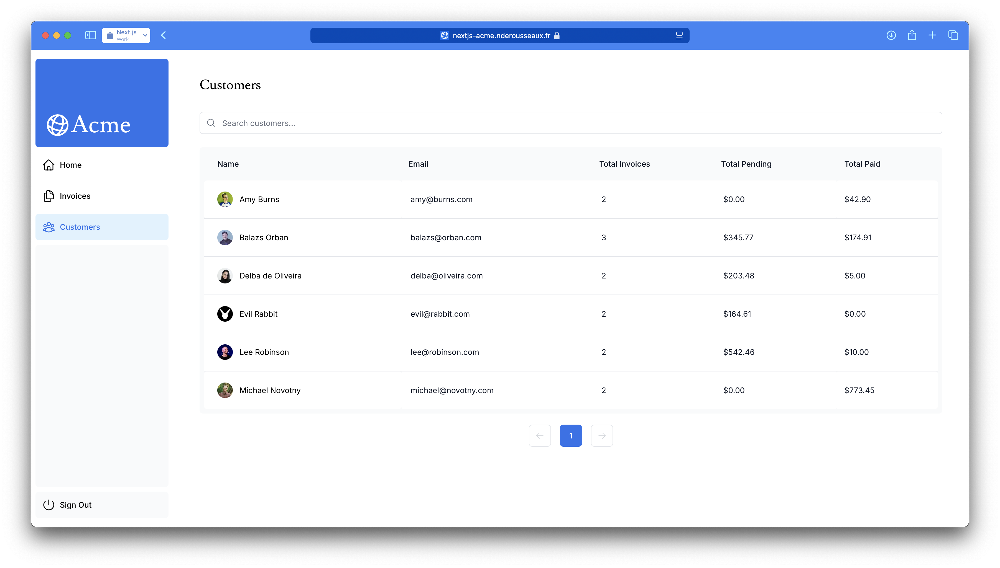
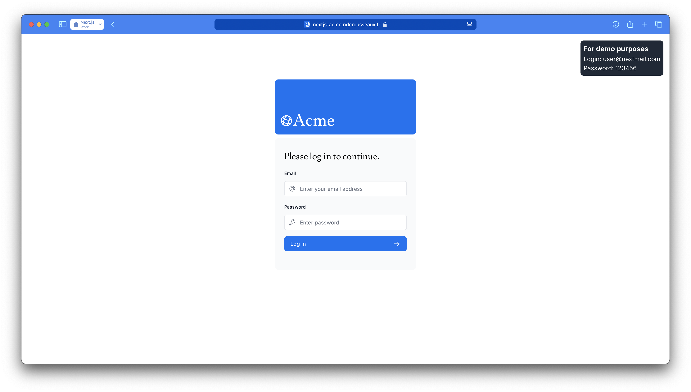
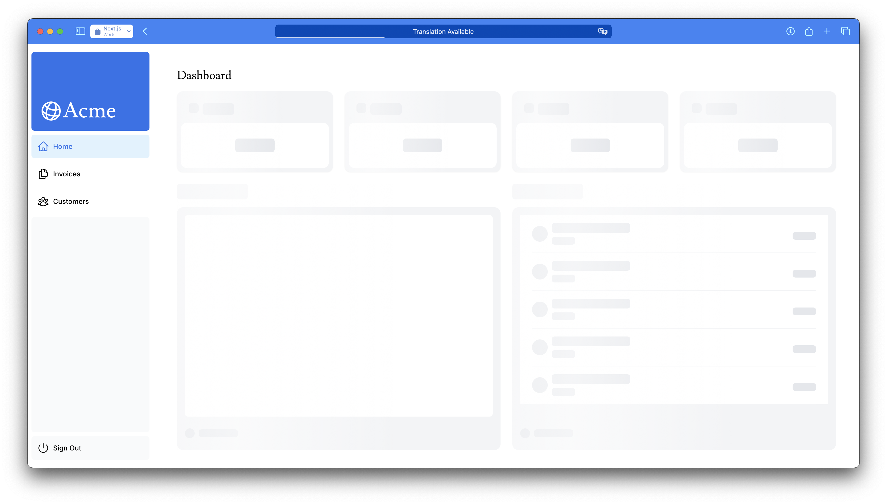
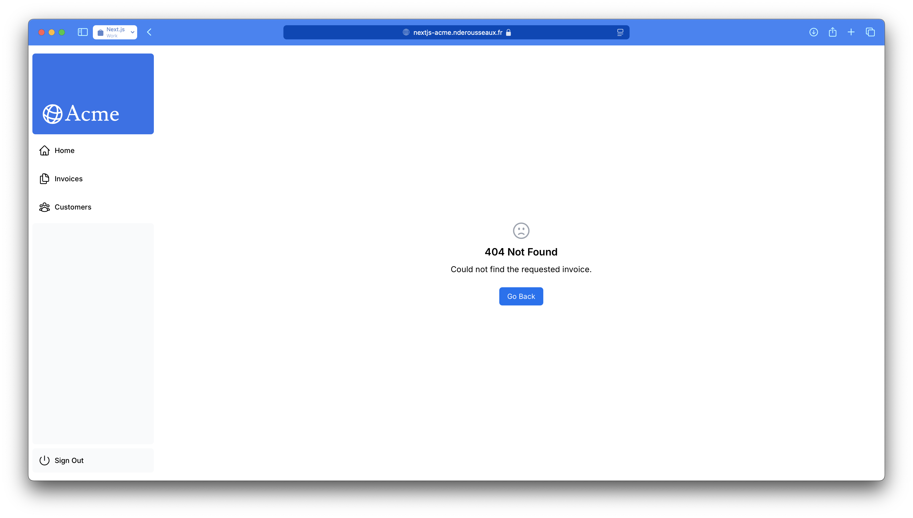

<p align="center">
	
</p>

<p align="center">
	
</p>

# <div align="center">Next.js Acme</div>
<div align="center">
	<samp>Training project for learning Next.js App Router, through the official tutorial.</samp>
</div>

<hr>

## ℹ️ About
This project is a training project for learning Next.js App Router, through the [official tutorial](https://nextjs.org/learn/dashboard-app). It is a simple dashboard app, that has a list of invoices, and a list of customers. The user can navigate between the two lists, and see the details of each invoice or customer.

<p align="center">
	
</p>

## ✨ Features
- **Invoices list**
	- Display a list of invoices
	- Pagination
	- Searching invoices
	- Add a new invoice
	- Edit an invoice
	- Delete an invoice

- **Customers list**
	- Display a list of customers
	- Pagination
	- Searching customers

## 🚀 Tech Stack & Practices
The purpose of this project is to implement the best practices of web app development : 
- Nested routing
- Server-side rendering (SSR)
- Partial Pre-rendering
- Dynamic rendering
- Streaming
- Responsive design
- Loading skeleton
- Images and fonts optimization
- Authentication
- Server-side form validation
- Handling errors (404, 500)
- Pagination
- Search with URL parameters
- Mutating data, with refreshing the cache
- Accessibility
- SEO optimization
- Prepare to social sharing

## 🛠️ Getting started

### Installation
```bash
$ pnpm install
$ cp .env.example .env
```

And fill the `.env` file with the appropriate values. (fill the `AUTH_SECRET` with the output of `openssl rand -base64 32`)

Then, you can go to `localhost:3000/seed` to seed the database with some dummy data.

### Development
```bash
$ pnpm run dev 
#or, with vercel
$ vercel dev
```

### Deployment
```bash
$ vercel --prod
```

Or simply push to the main branch, if you have the vercel integration enabled.

> **Note:** Don't forget to set the environment variables in the vercel dashboard.

## Future improvements
- Internationalization
- Add a dark mode
- Push futher the SEO optimization

## 🌅 Some screenshots
<div>
	
	
	
	
	
	
	
	
</p>